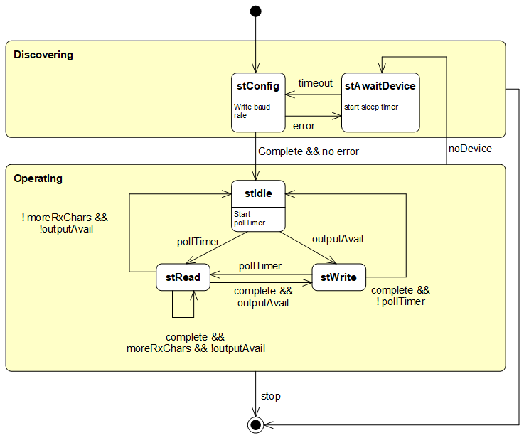

# MCCI Modbus Serial Protocol

This library contains the protocol definitions for the MCCI Modbus Serial Protocol, which defines a way to transport full-duplex serial data over Modbus reasonably efficiently.

[](https://github.com/mcci-catena/MCCI_Modbus_Serial_Protocol/releases/latest) 

**Contents:**

<!--
  This TOC uses the VS Code markdown TOC extension AlanWalk.markdown-toc.
  We strongly recommend updating using VS Code, the markdown-toc extension and the
  bierner.markdown-preview-github-styles extension.  Note that if you are using
  VS Code 1.29 and Markdown TOC 1.5.6, https://github.com/AlanWalk/markdown-toc/issues/65
  applies -- you must change your line-ending to some non-auto value in Settings>
  Text Editor>Files.  `\n` works for me.
-->

<!-- markdownlint-disable MD033 MD004 -->
<!-- markdownlint-capture -->
<!-- markdownlint-disable -->
<!-- TOC depthFrom:2 updateOnSave:true -->

- [Terminology](#terminology)
- [Modbus Register Mapping](#modbus-register-mapping)
	- [Background](#background)
		- [Long Registers (5-digit)](#long-registers-5-digit)
		- [Long Registers (6-digit)](#long-registers-6-digit)
- [Serial Protocol Registers](#serial-protocol-registers)
	- [Status Register](#status-register)
	- [RxData Registers](#rxdata-registers)
	- [Transmit registers](#transmit-registers)
- [Intended Use Pattern](#intended-use-pattern)
	- [Discovery Macro-state](#discovery-macro-state)
		- [`stConfig`](#stconfig)
		- [`stAwaitDevice`](#stawaitdevice)
	- [Operating Macro-state](#operating-macro-state)
		- [`stIdle`](#stidle)
		- [`stRead`](#stread)
		- [`stWrite`](#stwrite)
- [Library Usage](#library-usage)

<!-- /TOC -->
<!-- markdownlint-restore -->
<!-- Due to a bug in Markdown TOC, the table is formatted incorrectly if tab indentation is set other than 4. Due to another bug, this comment must be *after* the TOC entry. -->

## Terminology

Modbus literature uses "host" and "slave". Time has moved on, so in this library, we use the terms "host" and "device".

## Modbus Register Mapping

### Background

A Modbus device is essentially a group of registers that can be read and written by the host.

There are four classes of device registers. Each class has an independent address space supporting up to 65,536 registers of that kind.

1. _Discrete_ registers contain a single bit, and are read-only.
2. _Coil_ registers contain a single bit, and are read/write.
3. _Input_ registers contain sixteen bits, and are read-only.
4. _Holding_ registers contain sixteen bits, and are read/write.

Devices are free to define whether these classes of registers interact or are independent, and to implement only some of the classes.  Many devices choose to make Input and Holding register spaces refer to the same underlying storage. See section 4 of the [Modbus Protocol Specification](http://modbus.org/docs/Modbus_Application_Protocol_V1_1b3.pdf) for more information.

There are several ways of referring to device registers in Modbus literature.

1. By class and bus address.
2. By class and register number.
3. By long register number.

_Bus Addresses_ are the numbers transmitted on the bus to identify a given register. These are zero-origin and in the range [0x0000..0xFFFF]. They are generally given in hexadecimal.

_Register Numbers_ are generally used in documentation. Register numbers start from 1, and are written in decimal, and so they are in the range [1..65536].  Register number 1 is the same as bus address 0x0000.

The _long register number_ convention uses a five- or six-digit number which combines class and address. The first digit is `0` for Coils, `1` for Discrete Inputs, `3` for Input Registers, and `4` for holding registers. Therefore, the overall address is unique for all registers across all the classes. Like simple Register Numbers, these are offset by one from the bus address. If five-digit numbers are used, you're limited to 9999 registers.

The following tables summarize this, first for 5-digit long registers, then for 6-digit registers.

#### Long Registers (5-digit)

Class        | 5-digit Register Range | Bus Address range | Register range
-------------|------------------------|-------------------|-----------------------
Coil         | 00001-09999            | 0-0x270E          | 1-10000
Discrete     | 10001-19999            | 0-0x270E          | 1-10000
Input        | 30001-39999            | 0-0x270E          | 1-10000
Holding      | 40001-49999            | 0-0x270E          | 1-10000

#### Long Registers (6-digit)

Class        | 6-digit Register Range | Bus Address range | Register range
-------------|------------------------|-------------------|---------------------
Coil         | 000001-065536          | 0-0xFFFF          |  1-65536
Discrete     | 100001-165536          | 0-0xFFFF          |  1-65536
Input        | 300001-365536          | 0-0xFFFF          |  1-65536
Holding      | 400001-465536          | 0-0xFFFF          |  1-65536

## Serial Protocol Registers

The Serial over Modbus protocol uses a small number of input registers and holding registers. It doesn't use any discrete or coil registers. All registers can be read as either holding or input registers using the same register number. Some registers are read-only, and the attempts to write them via holding register operations will have no effect, and may cause an error to be reported.

The address space is somewhat sparse. Reads of undefined registers shall either return 0 or error status. Writes to undefined registers shall either be ignored or shall return error status.

32-bit registers are represented by two sequential registers, high order followed by low order. If signed, the number is represented in two's complement. If unsigned, the number ranges from 0 to `UINT32_MAX`.

Register   | Class   | Type         | Bus      | Name           | Description
:---------:|:-------:|:------------:|:--------:|:---------------|----------
1          | Input   | `int32`      | `0x0000` | `DummyReg`     | a dummy register, always zero. Useful for probing.
3          | Holding | `int32`      | `0x0002` | `Baudrate`     | Baud rate in bits/second. Always reflects last value written by host, except after device reset.
1001       | Input   | `uint16`     | `0x03E8` | `Status`       | Status register, see [below](#status-register).
1002..1064 | Input   | `uint16[63]` | `0x03E9` | `RxData`       | 63 words (126 bytes) of input data. The high-order byte is the first character in each word. See [below](#rxdata-registers).
2001..2063 | Holding | `uint16[63]` | `0x07D0` | `TxData`       | 63 words (126 bytes) of output data. See [below](#transmit-registers).
2064       | Holding | `uint16`     | `0x080F` | `TxDataByte`   | Single byte output register, see [below](#transmit-registers).

### Status Register

The status register has the following bit layout.

|    15    |  14..8    |     7           | 6..0
|:--------:|:---------:|:---------------:|:-----------
`Connect`  | `TxAvail` | reserved (zero) | `RxAvail`

The device sets the `Connect` bit when it believes that a device is connected that will consume bytes written to `TxData`.  For example, if communicating with a USB serial port, this will be set if the host is connected.

`TxAvail` represents the number of characters available in the output queue. This allows the host to throttle its output so as not to overrun the buffering capacity of the device. The value ranges from 0 (for full) to 126 (for empty).

The reserved bit is always zero.

`RxAvail` represents the number of characters available in the input queue. This value ranges from 0 (for empty) to 126 (if full).

### RxData Registers

Receive data registers are special, in that reads consume data from the input queue. Writes have no effect; they are either ignored or cause an error to be returned.

The semantics are best explained after we describe the expected use. Generally, the host reads several registers, starting with the `Status` register. It receives an image of the status register (in the first 2 bytes); followed by the requested number of words from the `RxData` registers.  `Status.RxAvail` specified how many bytes of valid receive data are present. If this value is greater than or equal to twice the number of `RxData` registers requested, then all the bytes returned are data bytes. Otherwise, the host has read more registers than available bytes; the first register values contain data, and the remaining registers are returned as zero. If no data is available at all, then `Status.RxAvail` will be zero, and all the returned registers will be zero.

Note that if one Read Multiple Registers (0x04) command is used to read `Status` followed by multiple `RxData` registers, the resulting image of `Status.RxAvail` will be set to the value that applied _before_ any `RxData` registers were read. Software can compute how many bytes remain by subtracting twice the number of RxData registers read from `Status.RxAvail`; if the result is zero or negative then no characters remain.

### Transmit registers

Transmit data registers are special, in that writes cause data to be placed in the output queue for the UART. Reads have no effect; the device returns zeros.

One transmit data register is special, `TxDataByte`, register 2064. When written, the high-order 8 bits are appended to the output queue; the low-order 8 bits are ignored.

The other transmit registers 2001 through 2063 are equivalent; any write to any of these registers causes two bytes to be appended to the output queue. The high-order 8 bits are appended first; the low-order 8 bits are then appended.

If the host uses Write Multiple Registers (0x16), the host can write an even number of bytes by writing to any range of registers between 2001 and 2063 in a single operation. The host can write an odd number of bytes by making sure the last register written is `TxDataByte` (2064).  The library `ModbusSerialProtocol::Status::getTxRegisterAndCount()` will compute a suitable byte count, starting register, and register count based on a previously-observed value of the `Status` register, and the number of bytes the client would like to write.

If the host attempts to write more bytes to the output queue than the device can hold, the data is discarded. The device _may_ return an error, or may discard the characters silently.

Because of timing splinters, the device might open up slots after the host reads the `Status` register, before the host has a chance to transmit. This is OK; the host must regularly read the status register anyway (for draining the receive queue), and so the host will schedule an additional byte later.

## Intended Use Pattern

We intend that the host will use an FSM like the following to manage the device.



The following states are given.

### Discovery Macro-state

The states in this group are used while bringing up a connection to the device. In the real world, an external serial port may be powered on or off, or connected/disconnected at any time. The host needs to adapt to this. In any of these states, the FSM may want to watch for an exit request, and shut down the FSM in response.

#### `stConfig`

Configure the device by writing the baud rate, if needed. If the device doesn't respond, assume connectivity problems and start waiting for the device to come back.  Otherwise proceed to the operating macro-state.

#### `stAwaitDevice`

Start a slow timer (say, two seconds). When the timer expires, return to `stConfig`. If the device is not connected, `stConfig` will try to set baud rate, fail, and return to `stAwaitDevice`.

### Operating Macro-state

The states in this group are used to operate the device.  In all of these states, if Modbus reports an error indicating that the device didn't respond, return to `stAwaitDevice`. If an exit request comes from the local environment, shut down the FSM in response.

#### `stIdle`

On entry to this state, start a fast timer. The time needs to be optimized for the desired polling interval, the speed of the Modbus connection, and the size of the default read request. If Modbus is running at 19200 baud, a request for multiple registers takes 9 byte times, or about 5ms; the response (if reading status plus one register) is 8 bytes, or around 9ms. Thus the polling interval should be at least 20 ms; 100 ms is probably a better choice. (It might be reasonable to vary this adaptively. If the external UART is running at 9600 baud and can tolerate the latency, you can easily keep up.  If the external UART is USB, there will be source handshaking so overrun is not a problem.)

In the idle state, if a request to write data arrives, go to `stWrite`. If the timer expires, go to `stRead`.

#### `stRead`

On entry to this state, launch a read of `Status` and `RxData` (registers 1001 and 1002) as a single "read input registers" (0x04) command. When the read completes, inspect the value of `Status.RxAvail`. If it indicates that 1 or 2 characters are available, then the `RxData` image contains the data (and no more data is currently available). If it indicates that 0 characters are available, then ignore `RxData`. If it indicates that more than 2 characters are available, then the `RxData` image contains the first two characters; and there are `Status.RxAvail - 2` more characters available for read.

Set `nRxAvail` (an internal state variable) to the number of remaining characters (`Status.RxAvail - 2` or zero). Set `nTxAvail` to the number of available characters (`Status.TxAvail`).

Now, if there is any write data available from the application, and `Status.TxAvail` > 0 (or a suitable minimum), go to `stWrite`. Otherwise, if `Status.RxAvail - 2 > 0`, issue another read for `Status` plus up to 63 more registers. Otherwise go to `stIdle`.

#### `stWrite`

On entry to this state, if we do not have a valid image of `Status`, go to `stRead`.

Otherwise consult `nTxAvail`. If non-zero, construct a Write Multiple Registers (0x10) command carrying the transmit data. Don't send more than `Status.TxAvail` bytes.

When the command completes, reduce `nTxAvail` by the number of characters sent. Then, if the poll timer has expired, or if `nRxAvail > 0`, go to `stRead` (read `Status` and poll the input queue).

Otherwise, if there is more write data to send, and `nTxAvail > 0`, send more data and remain in this state.

Otherwise, if there is more write data to send but `nTxAvail == 0`, go to `stRead`.

Otherwise go to `stIdle`.

## Library Usage

```c++
#include <MCCI_Modbus_Serial_Protocol.h>
```
